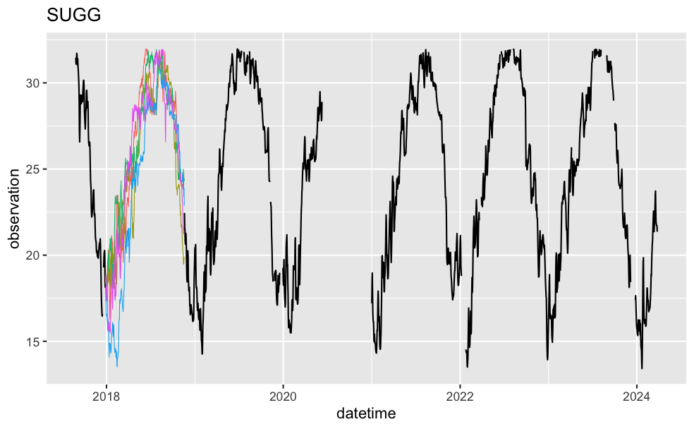

# hotdeckfc
Seasonally-local, hot-deck-based simulated sample path forecasting


## Introduction
### Come again?
By "seasonally-local", I mean that all historical data at the same part of the season (e.g. all historical Octobers) is used for forecasting.

By "hot-deck-based", I mean that forecasts are derived from historical observations that are close to the current observation/forecast.

By "simulated sample path", I mean that every particular forecast is produced via a random sampling, using said seasonally-local data.

### Premise
The basic idea is to perform similarly to a climatology model (i.e. use the average and spread of historical observations for a particular day of the year as the forecast), but with (_audience_) "More! Power!".

In it's basic form, it loosens up the climatology model's statement that "a day of the year will be similar to its historical observations" to "a day of the year will be similar to historical observations around its time of year".

That is to say, it can be made to perform like a simple moving average over the climatology model. However, it can do more, such as take into account recent observations, incorporate covariate observations, and use different sampling methods.

### What does it do?
The basic use goes like this:
  - Forecast a day:
    - Say it's October 3 2024, and you have three years of historical daily data.
    - Take the local observations, using some window (say 20 days, so September 13 - October 23 across all years).
    - Find the n closest (say 5) of those observations to your latest (October 3) observation.
    - Randomly sample from those n closest observations (say September 28 2023).
    - Take that sample's tomorrow's observation (Sep 29 2023) as the forecast for October 4 2024.
  - Shift everything over by a day to forecast Oct 5 2024 ... repeating through to your desired horizon.
  - Loop through this several times to produce multiple forecast paths.

### Why I made it
I made this for the [NEON Ecological Forecasting Challenge](https://projects.ecoforecast.org/neon4cast-ci/).

## Pros, Cons, and Limitations
### Pros
  - 🚙 _Acceptably_ fast.
    - I've sped this up to the point where it's, well, acceptably fast when doing a grid search CV. This primarily comes from memoization. Also, apparently operations involving dates are slow, so I tried to minimize the use of those.
  - Missing data is okay (sometimes, see below).
  - Extensible(ish).
    - You can supply your own `sampler`s, with some limitations. The two current limitations I'm aware of are below. I'm fairly sure I know how to incorporate them, I just haven't had a pressing interest yet:
      1. Multivariable models don't work
      2. Returning a distribution (e.g. mean + sd) doesn't work
  - Cross validation can be performed normally.
      
### Cons
  - Seasonal gaps (i.e. no data at a particular region of the season across all seasons) can be problematic.
  - Edges (i.e. when you have a very large seasonal gap, say 50% of the season) are difficult to deal with.
    - I've devoted a significant proportion of the development time to trying to improve this.
  - Particular sample path simulations can get trapped by unique sections of the historical data.
  
### Limitations
  - Currently this only works with daily observations of annual data. You might be wondering why I've named all these functions parameters as "datetime" then. Optimism, I suppose.
  - Multivariable models don't work.
  - Returning a distribution (e.g. mean + sd) doesn't work.

# Usage
## Example Code
```{r}
data = append_lead(hotdeckfc::SUGG_temp, observation)
data = trim_leading_nas(data, observation)
fc = hot_deck_forecast(data,
                       .datetime = date,
                       .observation = observation,
                       times = 3,
                       h = 20,
                       window_back = 20,
                       window_fwd = 20,
                       n_closest = 5,
                       sampler = sample_lead())
```

## Concerning `sampler`s
Aside from the data and some fairly straightforward parameters, the forecast depends upon a `sampler`. The `sampler` is what gives you your forecasts. All current samplers depend upon some data-derived column added to your existing data. For instance, the default `sampler`, `sampler_lead`, depends upon a column of leads of your observations existing in the data. Each `sampler` currently implemented in this package has a corresponding `append_*` function for adding these required columns.

# `hotdeckfc` in action
I've been using it to submit forecasts to the forementioned NEON forecasting challenge. 

## Single Forecasts
Below are a few forecasts. In all images, the grey lines are historical data, the red dot is the latest observation, the thin colored lines / dots are forecasts, and the red line is the forecast mean.

Highly different-across-seasons, gappy data:


Fuzzy in, fuzzy out:


Can still get a spread with few seasons of data:


Recent observations can affect the model:


A case that `hotdeckfc` has difficulty with:


Another difficult case:


## Forecasts Over Time
Here we can see the typical expected performance. Black dots are actual measurements, blue dots are the climatology model's mean, and colored lines are the hotdeck simulated forecast means. The forecasts start out near the last observation, then gradually converge. The climatology model has a bit more variable of a mean sequence, which means (no pun intended) that it will sometimes accidentally be closer to the actual measurements than the hotdeck mean is.


## Interactive Plotting
I made a Shiny widget for interactive experimenting. I've found it a great way to figure out what general values of parameters to use for difficult cases where I have no idea what will give plausible forecasts.


## Imputation?
It has been in the back of my mind that this could be a useful way to generate plausible sample paths for multiple imputation, particulary for longer gaps. I haven't really investigated it yet, but here is an (unoptimized) example of a 326-day 5-fold imputation:



# TODO
  - [x] Provide plotting functions. I have several written, I just need more experience with them to see which might be useful to a wider audience.
  - [ ] Documentation. I mean.. vignettes?
  - [x] Improve this README
