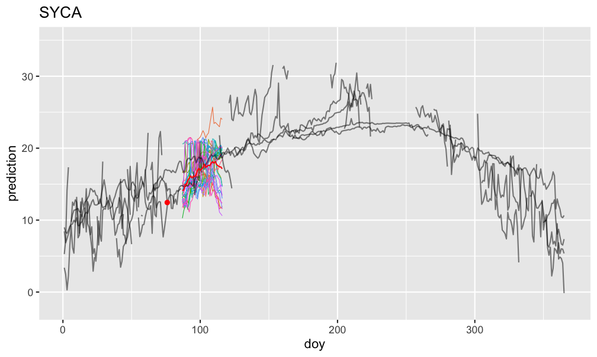
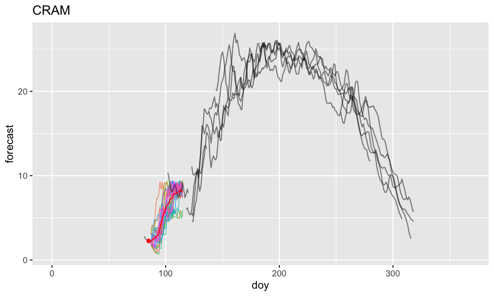

# hotdeckfc
Seasonally-local simulated sample path forecasting


## Introduction
### Come again?
By "seasonally-local", I mean that all historical data at the same part of the season (e.g. all historical Octobers) is used for forecasting.

By "simulated sample path", I mean that every particular forecast is produced via a random sampling, using said seasonally-local data.

### Premise
The basic idea is to perform similarly to a climatology model (i.e. use the average and spread of historical observations for a particular day of the year as the forecast), but with (_audience_) "More! Power!".

It loosens up the climatology model's statement that "a day of the year will be similar to its historical observations" to "a day of the year will be similar to historical observations around its time of year".

### What does it do?
The basic use goes like this:
  - Forecast a day:
    - Say it's October 3 2024, and you have three years of historical daily data.
    - Take the local observations, using some window (say 20 days, so September 13 - October 23 across all years).
    - Find the n closest (say 5) of those observations to your latest (October 3) observation.
    - Randomly sample from those n closest observations (say September 28 2023).
    - Take that sample's tomorrow's observation (Sep 29 2023) as the forecast for October 4 2024.
  - Shift everything over by a day to forecast Oct 5 2024 ... repeating through to your desired horizon.
  - Loop through this several times to produce multiple forecast paths.

### Why I made it
I made this for the [NEON Ecological Forecasting Challenge](https://projects.ecoforecast.org/neon4cast-ci/).

## Pros and Cons
### Pros
  - Cross validation can be performed normally.
  - 🚙 _Acceptably_ fast.
    - I've sped this up to the point where it's, well, acceptably fast when doing a grid search CV. This primarily comes from memoization. Also, apparently operations involving dates are slow, so I tried to minimize the use of those.
  - Heteroskedasticity schmeteroskedasticity
  - Extensible(ish)
    - You can supply your own samplers, with some limitations. The obvious one that comes to mind is that I haven't really given multivariable models much thought, so I'm not sure to what extent attempting such a model will work.
   
### Cons
  - Seasonal gaps (i.e. no data at a particular region of the season across all seasons) can be problematic.
  - Edges (i.e. when you have a very large seasonal gap, say 50% of the season) are difficult to deal with.
    - I've devoted a significant proportion of the development time to trying to improve this.
  - Particular sample path simulations can get trapped by unique sections of the historical data.

# Usage
## `hotdeckfc` in action
I've been using it to submit forecasts to the forementioned NEON forecasting challenge. 

### Single Forecasts
Below are a few forecasts. In all images, the grey lines are historical data, the red dot is the latest observation, the thin colored lines are forecasts, and the red line is the forecast mean.

Highly different-across-seasons, gappy data can be handled:


...but it's not a miracle worker:


Fuzzy in, fuzzy out:


Few seasons to go off of:


Recent observations can affect the model:


Thar be dragons:


### Forecasts Over Time
Here we can see the typical expected performance. Black dots are actual measurements, blue dots are the climatology model's mean, and colored lines are the hotdeck simulated forecast means. The forecasts start out near the last observation, then gradually converge. The climatology model has a bit more variable of a mean sequence, which means (no pun intended) that it will sometimes accidentally be closer to the actual measurements than the hotdeck mean is. I think. It makes sense, and the data is pointing in that direction.


### Imputation?
It has been in the back of my mind that this could be a useful way to generate plausible sample paths for multiple imputation, particulary for longer gaps. I haven't really investigated it yet, but here is an (unoptimized) example of a 326-day 5-fold imputation:


## Example Code
```{r}
  data = readr::read_csv(test_path("SUGG_target_temp_data.csv")) %>%
    as_tsibble(index = datetime) %>%
    fill_gaps()

  data = data %>% lead_mutator(observation)

  output = data %>%
    hot_deck_forecast(
      .datetime = datetime,
      .observation = observation,
      times = 30,
      h = 30,
      window_back = 20,
      window_fwd = 20,
      n_closest = 10,
      sampler = hot_deck_lead_sampler()
    )
```

# TODO
  - [ ] Actually read the metaprogramming section of Advanced R.
  - [ ] Better metaprogramming. Will fix some edge cases I know about, and maybe some I don't know about.
  - [ ] Provide plotting functions. I have several written, I just need more experience with them to see which might be useful to a wider audience.
  - [ ] Documentation. I mean.. vignettes?
  - [ ] Improve this README
