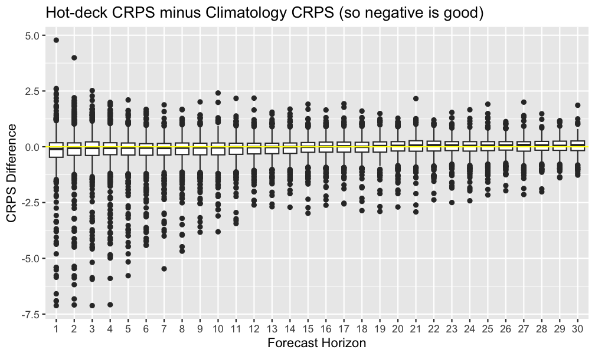

# hotdeckts
Seasonally-local, hot-deck-based simulated sample path forecasting and multiple imputation for daily data with yearly seasonality.


## Introduction
### Come again?
By "seasonally-local", I mean that all historical data at the same part of the season (e.g. all historical Octobers) is used for forecasting.

By "hot-deck-based", I mean that forecasts are derived from historical observations that are close to the current observation/forecast.

By "simulated sample path", I mean that every particular forecast is produced via a random sampling, using said seasonally-local data.

By "daily data with yearly seasonality", I mean you have one observation per Date, and you can expect a given day of the year to have similar observations across years.

### Premise
#### Forecasting
The basic idea is to perform similarly to a climatology model (i.e. use the average and spread of historical observations for a particular day of the year as the forecast), but with (_audience_) "More! Power!".

In it's basic form, it loosens up the climatology model's statement that "a day of the year will be similar to its historical observations" to "a day of the year will be similar to historical observations around its time of year".

That is to say, it can be made to perform like a simple moving average over the climatology model. However, it can do more, such as take into account recent observations, incorporate covariate observations, and use different sampling methods.

#### Imputation
The idea for this whole package originated with predictive mean matching imputation: [Flexible Imputation of Missing Data, 2nd Ed. by Stef van Buuren](https://web.archive.org/web/20220823155812/https://stefvanbuuren.name/fimd/sec-pmm.html).

### How does it work?
An approximate image of what's happening can be found at [Flexible Imputation of Missing Data, 2nd Ed. by Stef van Buuren](https://web.archive.org/web/20220823155812/https://stefvanbuuren.name/fimd/sec-pmm.html).

The basic use goes like this:
  - Forecast a day:
    - Say it's October 3 2024, and you have three years of historical daily data.
    - Take the local observations, using some window (say 20 days, so September 13 - October 23 across all years).
    - Find the n closest (say 5) of those observations to your latest (October 3) observation.
    - Randomly sample from those n closest observations (say September 28 2023).
    - Take that sample's tomorrow's observation (Sep 29 2023) as the forecast for October 4 2024.
  - Shift everything over by a day to forecast Oct 5 2024 ... repeating through to your desired horizon.
  - Loop through this several times to produce multiple forecast paths.
  
#### Imputation
Imputation follows the same outline as above, except it both forecasts and backcasts, then melds the two casts together at their closest point, taking the mean at that point, using the forecasts prior to the point, and the backcasts after the point.

### Why I made it
I made this for the [NEON Ecological Forecasting Challenge](https://projects.ecoforecast.org/neon4cast-ci/).

## Pros, Cons, and Limitations
### Pros
  - 🚙 _Acceptably_ fast.
    - I've sped this up to the point where it's, well, acceptably fast when doing a grid search CV. This primarily comes from memoization. Also, apparently operations involving dates are slow, so I tried to minimize the use of those.
  - Missing data is okay (sometimes, see below).
  - Extensible(ish).
    - You can supply your own `sampler`s, with some limitations. The two current limitations I'm aware of are below. I'm fairly sure I know how to incorporate them, I just haven't had a pressing interest yet:
      1. Multivariable models don't work
      2. Returning a distribution (e.g. mean + sd) doesn't work
  - Cross validation and grid search functionality included.
      
### Cons
  - Seasonal gaps (i.e. no data at a particular region of the season across all seasons) can be problematic.
  - Edges (i.e. when you have a very large seasonal gap, say 50% of the season) are difficult to deal with.
    - I've devoted a significant proportion of the development time to trying to improve this.
  - Particular sample path simulations can get trapped by unique sections of the historical data.
  
### Limitations
  - This only works with daily observations of annual data. You might be wondering why I've named all these functions parameters as "datetime" then. Optimism, I suppose.
  - Multivariable models don't work.
  - Returning a distribution (e.g. mean + sd) doesn't work.

# Usage
## Example Code
### Basic Forecast Workflow
This package operates on [`tsibble`s](https://tsibble.tidyverts.org/). Also, it is currently limited to operating on daily observations of annual data, and assumes that the temporal column (the `tsibble`'s `index`) is a `Date`. It also requires the latest observation to have been, well, observed (not `NA`). So, the data preparation requirements are:
  - Temporal column is of class `Date`.
  - Data is a `tsibble`.
  - Latest observation is not `NA`.

Example data preparation:
```{r}
# From non-tsibble
my_data = my_data %>% 
  dplyr::mutate(date = as.Date(date))
my_data = tsibble::as_tsibble(my_data, index = date)
my_data = trim_leading_nas(my_data, observation)

# If you already have a tsibble, may need to convert to tibble
# to mutate the temporal column.
my_data = my_data %>% 
  tibble::as_tibble() %>% 
  dplyr::mutate(date = as.Date(date))
my_data = tsibble::as_tsibble(my_data, index = date)
my_data = trim_leading_nas(my_data, observation)
```

Once your data is ready, you need to `append` any columns that are needed for your chosen `sampler` ([see below](#concerning-samplers)).
```
my_data = append_lead(hotdeckts::SUGG_temp, observation)
```

Then forecast. Note that you need to *call* the `sampler`, because they all use `purrr::partial()` internally.
```
fc = hot_deck_forecast(my_data,
                       .observation = observation,
                       times = 30,
                       h = 30,
                       window_back = 20,
                       window_fwd = 20,
                       n_closest = 5,
                       sampler = sample_lead())
```

### Picking Parameters
I have implemented a grid search CV and a Shiny widget to help find parameters.

#### Shiny widget
Using the Shiny widget is straightforward:
```
my_data = append_lead(hotdeckts::SUGG_temp, observation)
my_data = append_diff(my_data, observation)
shiny_visualize_forecast(my_data, .datetime = date, .observation = observation)
```

#### Grid search
Using the grid search requires setting up the grid. This is the most painful part of the package. The `window_args` and `sampler_args` each need a few things to be grouped together, e.g.:
  - The `window_back` and `window_fwd` params should be coupled for a given CV
  - The `sampler` and `appender` need to be coupled for a given CV

Because of how `tibble`s work, these complex objects need to be wrapped in `list()`s.

The other arguments can be passed as vectors, `c()`. Except if you're passing in a vector as a single argument for `n_closest`, in which case you'd need to wrap things in a `list()`. I'm not sure I've actually used the ability to pass a vector of length h to `n_closest`...

```
grid = build_grid(
  h = 30,
  n_closest = c(5, 10),
  # even if you only use a single `build_window_args()`, wrap in `list()`
  window_args = list(build_window_args(20)),
  # also need to wrap in list
  sampler_args = list(
    build_sampler_args(sa_name = "nxt",
                       sampler = sample_lead(),  # remember to call!
                       appender = append_lead)
  )
)
```

After building the grid, just pass it to the grid search:

```
out = grid_search_hot_deck_cv(hotdeckts::SUGG_temp,
                              .datetime = date,
                              .observation = observation,
                              grid = grid)
```

##### Evaluating Grid Search
There are many metrics you can use to evaluate forecast accuracy. In this package, there is `calc_cv_crps()`, which calculates the CRPS for a given CV. You can map the grid search output to this function, e.g.

```
gs_crps = out %>%
  purrr::map(\(x) c(x, list(crps = calc_cv_crps(x$cv_out, "observation"))))
```

There is a plotting function that uses this mapping internally:
```
plot_grid_search_crps(out, "observation", ymax = 5)
```

I've used this mapping as a precursor to a few CRPS metrics (not in the package), such as the total CRPS for a given CV:
```
crps_k_sums = function(arg_list, cv_crps_out) {
  name = paste("wf", sum(arg_list$window_fwd),
               "wb", sum(arg_list$window_back),
               "nc", sum(arg_list$n_closest),
               "sa_name", arg_list$sa_name)
  cv_crps_out %>% 
    group_by(k) %>% 
    select(k, score) %>% 
    summarise("{name}" := sum(score, na.rm = TRUE)) %>% 
    ungroup()
}

gs_crps_k_sums = gs_crps %>% 
  map(\(x) crps_k_sums(x$arg_list, x$crps)) %>% 
  reduce(\(acc, nxt) mutate(acc, nxt))
```

### Imputation
Imputation is straightforward.
```
imputed = hot_deck_impute(hotdeckts::SUGG_temp, observation)
```
Badda-bing, badda-boom. 

The imputation will fail if there are gaps in your data (across all seasons) that exceed your window. For instance, if you have November-February always missing, then a one-month window (+- 15 days) will fail. To avoid this, there is a `max_gap` parameter that will skip any gaps exceeding that size.

### Parameter Guidelines
#### Forecasting
The higher you set `n_closest`, the closer your model approaches just taking all of the local data and giving you something approaching a simple moving average of the climatology model.

`sample_lead()` tends to work well for data that has fairly consistent seasonality. 

`sample_diff()` may be more useful if there is little local data, or if the data takes fairly different paths seasonally.

`sample_covariate_lead()` only seems to be useful if you're desperate, such as forecasting in Spring a dataset that only has target variable observations for Summers. Similarly, I haven't impressed by the results I've gotten using `sample_forecasted_covariate()` (which is why I haven't gotten around to writing up how to use it in this README), but maybe I just need to try a few more datasets.

#### Imputing
I would hesitate to bump up the `n_closest` much, lest the paths become nonsense.

The `sampler` selection should be similar to the above advice for forecasting.

[How many imputations?](https://web.archive.org/web/20231130105636/https://stefvanbuuren.name/fimd/sec-howmany.html) Though, I suppose it'd probably be different for time series -- how long ago the missing data is, how big it is...

## Concerning Defaults
For the data that I have worked with, the parameters used in the forecasting example above, namely:
  - window_back = 20,
  - window_fwd = 20,
  - n_closest = 5,
  - sampler = sample_lead()
  
Seem to work well often. However, I have not worked with enough different data sources to feel comfortable saying that these are always sensible defaults.

## Concerning `sampler`s
Aside from the data and some fairly straightforward parameters, the forecast depends upon a `sampler`. The `sampler` is what gives you your forecasts. All current samplers depend upon some data-derived column added to your existing data. For instance, the default `sampler`, `sampler_lead`, depends upon a column of leads of your observations existing in the data. Each `sampler` currently implemented in this package has a corresponding `append_*` function for adding these required columns.


# `hotdeckts` Forecasting in Action
I've been using it to submit forecasts to the forementioned NEON forecasting challenge. 

## Performance vs Climatology Model After 1-2 Months
Here is the relative performance (via skill scores, i.e. (clim - h.d.) / clim) of this model vs the climatology model across all sites that I have submitted forecasts of to the NEON EFC, with per-site submission counts ranging from about 1 to 2 months.


And here are boxplots by forecast horizon, aggregated across all sites. There's not a whole lot in it on average:



This suggests that I should probably revisit my long-horizon forecasting.

## Single Forecasts
Below are a few forecasts. In all images, the grey lines are historical data, the red dot is the latest observation, the thin colored lines / dots are forecasts, and the red line is the forecast mean.

Highly different-across-seasons, gappy data:


Fuzzy in, fuzzy out:


Can still get a spread with few seasons of data:


Recent observations can affect the model:


A case that `hotdeckts` has difficulty with:


Another difficult case:


## Forecasts Over Time
Here we can see the typical expected performance. Black dots are actual measurements, blue dots are the climatology model's mean, and colored lines are the hotdeck simulated forecast means. The forecasts start out near the last observation, then gradually converge. The climatology model has a bit more variable of a mean sequence, which means (no pun intended) that it will sometimes accidentally be closer to the actual measurements than the hotdeck mean is.


## Interactive Plotting
I made a Shiny widget for interactive experimenting. I've found it a great way to figure out what general values of parameters to use for difficult cases where I have no idea what will give plausible forecasts.


# `hotdeckts` Imputation in Action
Here are a couple of imputations.

Can handle a highly aberrant path (2024), though some paths are unlikely (e.g. imputation_5, 2019):


Can handle large gaps:


# TODO
  - [x] Provide plotting functions. I have several written, I just need more experience with them to see which might be useful to a wider audience.
  - [ ] Documentation. I mean.. vignettes?
  - [x] Improve this README
